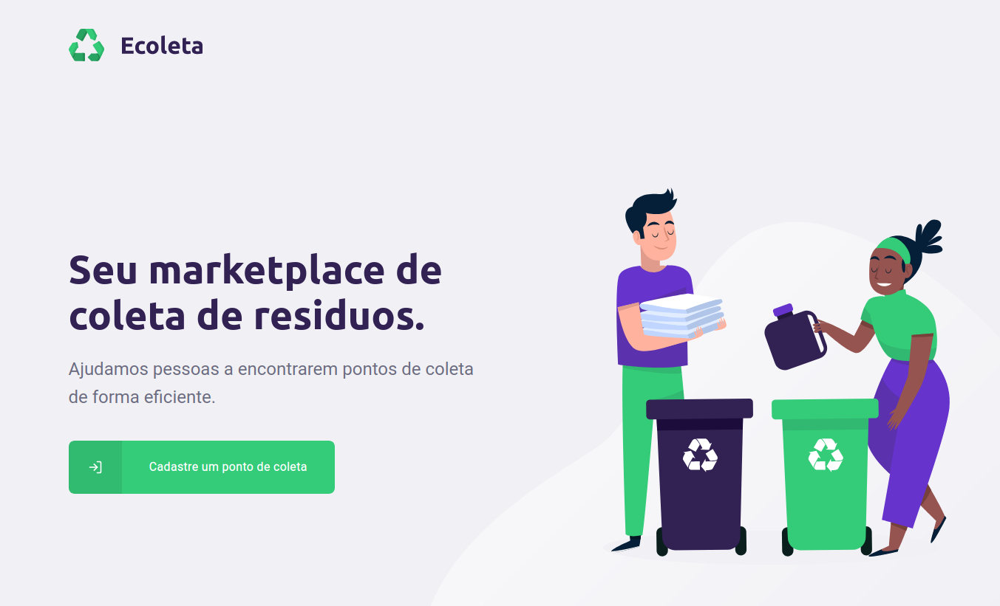

<h1 align="center">
    
<h1>

<p align="center">	

  
	
  <a href="www.linkedin.com/in/yamaral/">
    
  </a>

  <a aria-label="Completed" href="https://nextlevelweek.com/aulas/booster/1/edicao/1">
    </img>
  </a>
  
  <a href="https://github.com/ygoramaral96/ecoleta/commits/master">
    
  </a>
</p>

# Índice
- [Índice](#índice)
- [Sobre](#sobre)
- [Tecnologias utilizadas](#tecnologias-utilizadas)
- [Conhecimentos adquiridos](#conhecimentos-adquiridos)
- [Como baixar o projeto](#como-baixar-o-projeto)
  - [Iniciando a API](#iniciando-a-api)
  - [Iniciando a aplicação Web](#iniciando-a-aplicação-web)
  - [Iniciando a aplicação Mobile](#iniciando-a-aplicação-mobile)

---

# Sobre
Ecoleta é um marketplace de coleta de resíduos. 

Através da interface web é possível realizar o cadastro de pontos de coleta, possuindo um dropzone para upload de imagens e um mapa para cadastrar a geolocalização do ponto de coleta.

O back-end serve de comunicação com a aplicação web e mobile.

Com o aplicativo mobile, o usuário filtra os pontos de coleta através da seleção de uma cidade. 
Logo depois ele é direcionado a uma página com um mapa contendo os pontos de coleta daquele local, possibilitando também a seleção de filtros de cada resíduo.

O visual do projeto tem como base o template fornecido pela Rocketseat: https://www.figma.com/file/1SxgOMojOB2zYT0Mdk28lB/Ecoleta


<h2 align="center"> Aplicação Web </h2>
<p align="center">
    
</p>
<h2 align="center"> Aplicação Mobile </h2>
<p align="center">
    
</p>

---

# Tecnologias utilizadas

- API IBGE
- Axios
- CORS
- Expo
- Express
- KnexJS
- Leaflet
- Multer
- NodeJS
- React Native
- ReactJS
- SQLite
- ts-node
- TypeScript
  
---

# Conhecimentos adquiridos

- Criação de aplicações com React e React Native utilizando Typescript
- Utilização do [Expo](https://expo.io/) para criar o aplicativo mobile
- Upload de imagens com [react-dropzone](https://github.com/react-dropzone/react-dropzone)
- Geolocalização com o [Leaflet](https://leafletjs.com/)
- [Knex](http://knexjs.org/) migrations e seeds
- Utilização do [Multer](https://www.npmjs.com/package/multer)
- Validação de dados submetidos no back-end com [Celebrate](https://github.com/arb/celebrate)
  
---

# Como baixar o projeto

```bash

    # Clonar o repositório
    $ git clone https://github.com/ygoramaral96/ecoleta

    # Entrar no diretório baixado
    $ cd ecoleta

```

## Iniciando a API

```bash

    # Entrar no diretório do server
    $ cd server

    # Instalar as dependências
    $ npm install

    # Criar o banco de dados
    $ npm run knex:migrate

    # Inserir dados necessários no banco de dados
    $ npm run knex:seed

    # Por fim inicializar o servidor
    $ npm run dev

```

## Iniciando a aplicação Web

```bash

    # Entrar no diretório da aplicação web
    $ cd web

    # Instalar as dependências
    $ npm install

    # Inicializar o servidor
    $ npm start

```

## Iniciando a aplicação Mobile

```bash

    # Entrar no diretório da aplicação mobile
    $ cd mobile

    # Instalar as dependências
    $ npm install

    # Inicializar o servidor
    $ npm start

```
